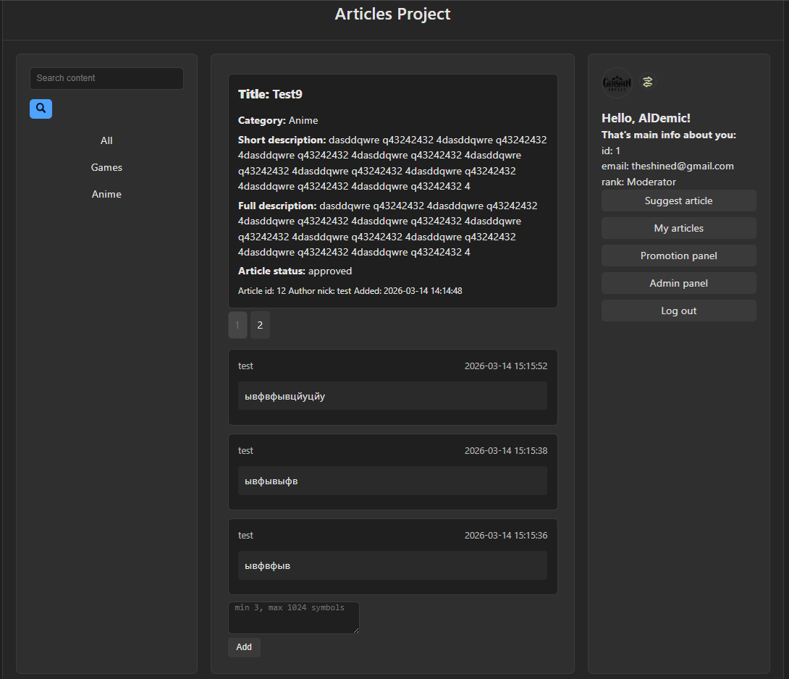
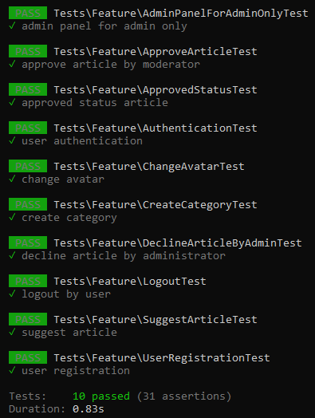
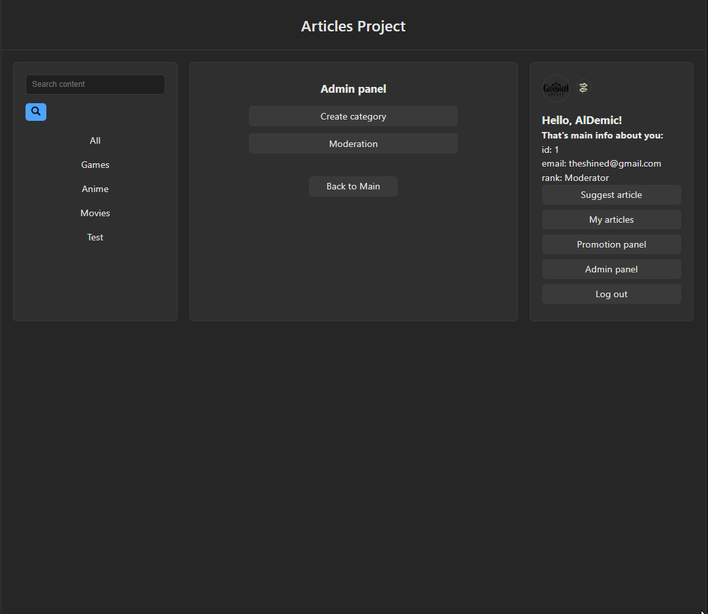

## 📝 Articles module [Laravel version]

## 🧩 Description

Laravel-based implementation of a small article management system.

The project demonstrates building a modular backend application using Laravel architecture.  
Users can create articles, comment on them, and interact with a moderated publication system.

The project focuses on backend development practices including routing, validation, access control and database relations.

Main goal — demonstrate practical usage of Laravel framework and modern backend architecture.

---

## 🚀 Improvements Compared to PHP Version

This project is a rebuild of my previous PHP-based article module.

Main improvements:

- Laravel routing instead of manual URL handling
- MVC architecture
- Blade templating
- Eloquent ORM
- FormRequest validation
- Policy-based authorization
- Service layer for business logic
- Pagination system
- File storage API for user avatars
- Improved database relations

---

## ⚙️ Technologies

* Laravel
* PHP
* MySQL
* Blade
* Eloquent ORM
* Policies
* FormRequest Validation
* REST-style routing
* Feature tests

---

## 🧱 Architecture

Main architecture flow:

Request → Route → Controller → Service → Model(Eloquent) → Database

Used patterns:

* Service Layer
* Policy-based authorization
* FormRequest validation
* Eloquent relationships
* Blade templating

---

## 🧩 Features

### Articles

* Create articles
* Edit articles
* Delete articles
* Article moderation system
* Public article list
* Article search
* Pagination

### Comments

* Add comments
* Paginated comment list
* User association

### Users

* Avatar upload
* Profile system
* Author attribution for articles and comments

### Access Control

* Article access policies
* Status-based publication system

---

## 🧪 Key Laravel Concepts Demonstrated

* Route Model Binding
* Eloquent relationships
* Lazy vs Eager loading
* FormRequest validation
* Policy authorization
* File storage API
* Pagination
* Blade reusable components
* Testing

---

## 🗄 Database

Project uses MySQL.

Run migrations to generate the schema.
php artisan migrate

Run seeds to fill up based ranks.
php artisan db:seed

---

## 📸 Screenshots

Project interface examples:







Additional screenshots available in:

```
/screenshots/
```

---

## ⚙️ Running the Module

Clone repository:

```
git clone https://github.com/AlDemic/articles-laravel
cd articles-laravel
```

Install dependencies:

```
composer install
```

Create environment file:

```
cp .env.example .env
```

Generate application key:

```
php artisan key:generate
```

Configure database connection inside `.env`.

Run migrations:

```
php artisan migrate
```

Start development server:

```
php artisan serve
```

Application will be available at:

```
http://127.0.0.1:8000
```

---

## 🎯 Purpose of the Project

This project is part of my backend development learning path.

The goal is to practice building real-world backend modules using Laravel framework and demonstrate understanding of backend architecture principles.
